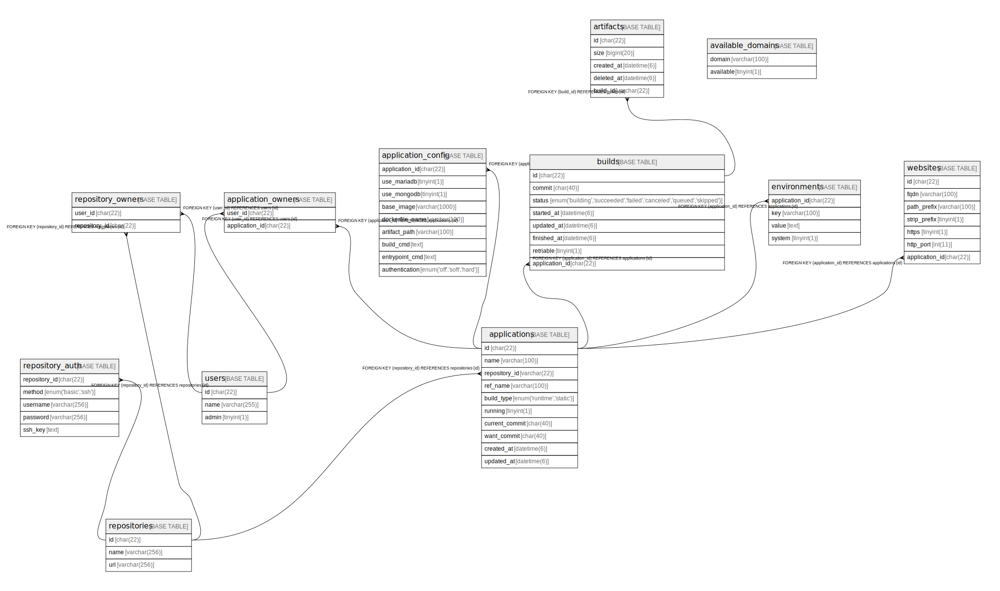

# neoshowcase

## Tables

| Name | Columns | Comment | Type |
| ---- | ------- | ------- | ---- |
| [applications](applications.md) | 10 | アプリケーションテーブル | BASE TABLE |
| [application_config](application_config.md) | 9 |  | BASE TABLE |
| [application_state](application_state.md) | 1 | デプロイの状態 | BASE TABLE |
| [artifacts](artifacts.md) | 5 | 静的ファイル生成物テーブル | BASE TABLE |
| [available_domains](available_domains.md) | 3 | 利用可能ドメインテーブル | BASE TABLE |
| [builds](builds.md) | 6 | ビルドテーブル | BASE TABLE |
| [build_status](build_status.md) | 1 | ビルドの状態 | BASE TABLE |
| [environments](environments.md) | 4 | 環境変数テーブル | BASE TABLE |
| [owners](owners.md) | 2 | アプリケーション所有者テーブル | BASE TABLE |
| [repositories](repositories.md) | 3 | Gitリポジトリテーブル | BASE TABLE |
| [users](users.md) | 2 | ユーザーテーブル | BASE TABLE |
| [websites](websites.md) | 6 | Webサイトテーブル | BASE TABLE |

## Relations

---

> Generated by [tbls](https://github.com/k1LoW/tbls)
