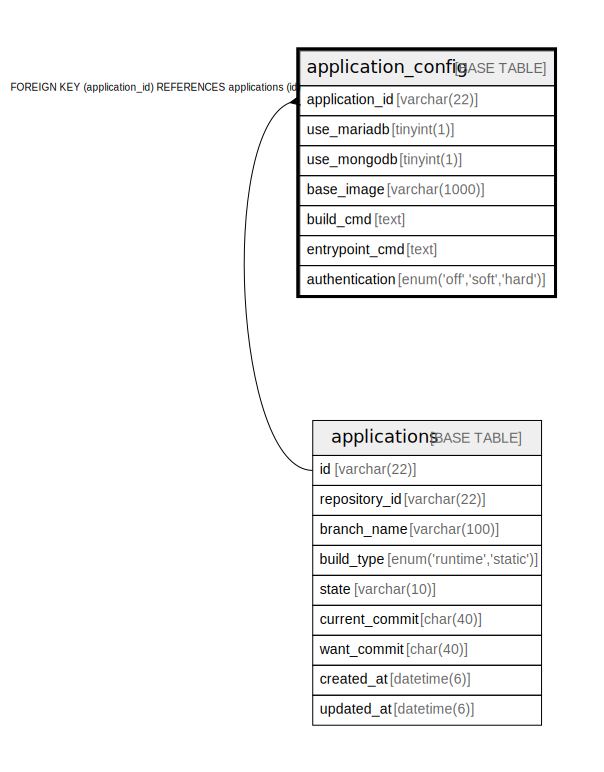

# application_config

## Description

<details>
<summary><strong>Table Definition</strong></summary>

```sql
CREATE TABLE `application_config` (
  `application_id` char(22) NOT NULL COMMENT 'アプリケーションID',
  `use_mariadb` tinyint(1) NOT NULL COMMENT 'MariaDBを使用するか',
  `use_mongodb` tinyint(1) NOT NULL COMMENT 'MongoDBを使用するか',
  `build_type` enum('runtime-cmd','runtime-dockerfile','static-cmd','static-dockerfile') NOT NULL COMMENT 'ビルドタイプ',
  `base_image` varchar(1000) NOT NULL COMMENT 'ベースイメージの名前',
  `build_cmd` text NOT NULL COMMENT 'ビルドコマンド(shell)',
  `entrypoint_cmd` text NOT NULL COMMENT 'コンテナのエントリポイント(shell)',
  `artifact_path` varchar(100) NOT NULL COMMENT '静的成果物のパス',
  `dockerfile_name` varchar(100) NOT NULL COMMENT 'Dockerfile名',
  `entrypoint_override` text NOT NULL COMMENT 'Entrypointの上書き(args)',
  `command_override` text NOT NULL COMMENT 'Commandの上書き(args)',
  PRIMARY KEY (`application_id`),
  CONSTRAINT `fk_application_config_application_id` FOREIGN KEY (`application_id`) REFERENCES `applications` (`id`)
) ENGINE=InnoDB DEFAULT CHARSET=utf8mb4 COLLATE=utf8mb4_general_ci
```

</details>

## Columns

| Name | Type | Default | Nullable | Children | Parents | Comment |
| ---- | ---- | ------- | -------- | -------- | ------- | ------- |
| application_id | char(22) |  | false |  | [applications](applications.md) | アプリケーションID |
| use_mariadb | tinyint(1) |  | false |  |  | MariaDBを使用するか |
| use_mongodb | tinyint(1) |  | false |  |  | MongoDBを使用するか |
| build_type | enum('runtime-cmd','runtime-dockerfile','static-cmd','static-dockerfile') |  | false |  |  | ビルドタイプ |
| base_image | varchar(1000) |  | false |  |  | ベースイメージの名前 |
| build_cmd | text |  | false |  |  | ビルドコマンド(shell) |
| entrypoint_cmd | text |  | false |  |  | コンテナのエントリポイント(shell) |
| artifact_path | varchar(100) |  | false |  |  | 静的成果物のパス |
| dockerfile_name | varchar(100) |  | false |  |  | Dockerfile名 |
| entrypoint_override | text |  | false |  |  | Entrypointの上書き(args) |
| command_override | text |  | false |  |  | Commandの上書き(args) |

## Constraints

| Name | Type | Definition |
| ---- | ---- | ---------- |
| fk_application_config_application_id | FOREIGN KEY | FOREIGN KEY (application_id) REFERENCES applications (id) |
| PRIMARY | PRIMARY KEY | PRIMARY KEY (application_id) |

## Indexes

| Name | Definition |
| ---- | ---------- |
| PRIMARY | PRIMARY KEY (application_id) USING BTREE |

## Relations



---

> Generated by [tbls](https://github.com/k1LoW/tbls)
