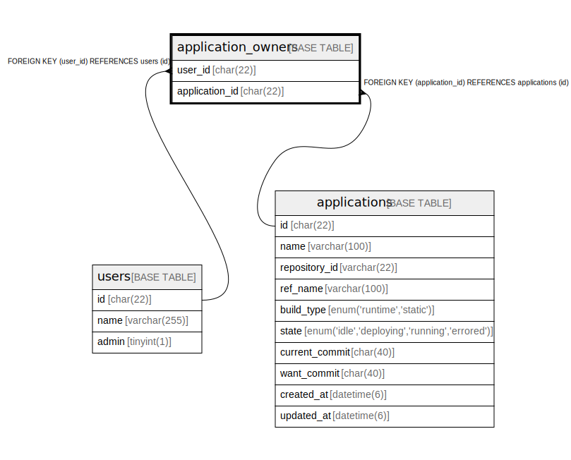

# application_owners

## Description

アプリケーション所有者テーブル

<details>
<summary><strong>Table Definition</strong></summary>

```sql
CREATE TABLE `application_owners` (
  `user_id` char(22) NOT NULL COMMENT 'ユーザーID',
  `application_id` char(22) NOT NULL COMMENT 'アプリケーションID',
  PRIMARY KEY (`user_id`,`application_id`),
  KEY `fk_application_owners_application_id` (`application_id`),
  CONSTRAINT `fk_application_owners_application_id` FOREIGN KEY (`application_id`) REFERENCES `applications` (`id`),
  CONSTRAINT `fk_application_owners_user_id` FOREIGN KEY (`user_id`) REFERENCES `users` (`id`)
) ENGINE=InnoDB DEFAULT CHARSET=utf8mb4 COLLATE=utf8mb4_general_ci COMMENT='アプリケーション所有者テーブル'
```

</details>

## Columns

| Name | Type | Default | Nullable | Children | Parents | Comment |
| ---- | ---- | ------- | -------- | -------- | ------- | ------- |
| user_id | char(22) |  | false |  | [users](users.md) | ユーザーID |
| application_id | char(22) |  | false |  | [applications](applications.md) | アプリケーションID |

## Constraints

| Name | Type | Definition |
| ---- | ---- | ---------- |
| fk_application_owners_application_id | FOREIGN KEY | FOREIGN KEY (application_id) REFERENCES applications (id) |
| fk_application_owners_user_id | FOREIGN KEY | FOREIGN KEY (user_id) REFERENCES users (id) |
| PRIMARY | PRIMARY KEY | PRIMARY KEY (user_id, application_id) |

## Indexes

| Name | Definition |
| ---- | ---------- |
| fk_application_owners_application_id | KEY fk_application_owners_application_id (application_id) USING BTREE |
| PRIMARY | PRIMARY KEY (user_id, application_id) USING BTREE |

## Relations



---

> Generated by [tbls](https://github.com/k1LoW/tbls)
