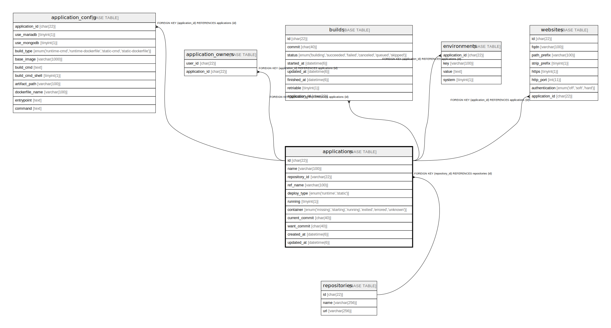

# applications

## Description

アプリテーブル

<details>
<summary><strong>Table Definition</strong></summary>

```sql
CREATE TABLE `applications` (
  `id` varchar(22) NOT NULL COMMENT 'アプリID',
  `owner` varchar(100) NOT NULL COMMENT 'アプリ所有者',
  `name` varchar(100) NOT NULL COMMENT 'アプリ名',
  `repository_id` varchar(22) NOT NULL COMMENT 'アプリのリポジトリID',
  `created_at` datetime(6) NOT NULL COMMENT '作成日時',
  `updated_at` datetime(6) NOT NULL COMMENT '更新日時',
  `deleted_at` datetime(6) DEFAULT NULL COMMENT '削除日時',
  PRIMARY KEY (`id`),
  KEY `fk_applications_repository_id` (`repository_id`),
  CONSTRAINT `fk_applications_repository_id` FOREIGN KEY (`repository_id`) REFERENCES `repositories` (`id`)
) ENGINE=InnoDB DEFAULT CHARSET=utf8mb4 COMMENT='アプリテーブル'
```

</details>

## Columns

| Name | Type | Default | Nullable | Children | Parents | Comment |
| ---- | ---- | ------- | -------- | -------- | ------- | ------- |
| id | varchar(22) |  | false | [branches](branches.md) |  | アプリID |
| owner | varchar(100) |  | false |  |  | アプリ所有者 |
| name | varchar(100) |  | false |  |  | アプリ名 |
| repository_id | varchar(22) |  | false |  | [repositories](repositories.md) | アプリのリポジトリID |
| created_at | datetime(6) |  | false |  |  | 作成日時 |
| updated_at | datetime(6) |  | false |  |  | 更新日時 |
| deleted_at | datetime(6) | NULL | true |  |  | 削除日時 |

## Constraints

| Name | Type | Definition |
| ---- | ---- | ---------- |
| fk_applications_repository_id | FOREIGN KEY | FOREIGN KEY (repository_id) REFERENCES repositories (id) |
| PRIMARY | PRIMARY KEY | PRIMARY KEY (id) |

## Indexes

| Name | Definition |
| ---- | ---------- |
| fk_applications_repository_id | KEY fk_applications_repository_id (repository_id) USING BTREE |
| PRIMARY | PRIMARY KEY (id) USING BTREE |

## Relations



---

> Generated by [tbls](https://github.com/k1LoW/tbls)
