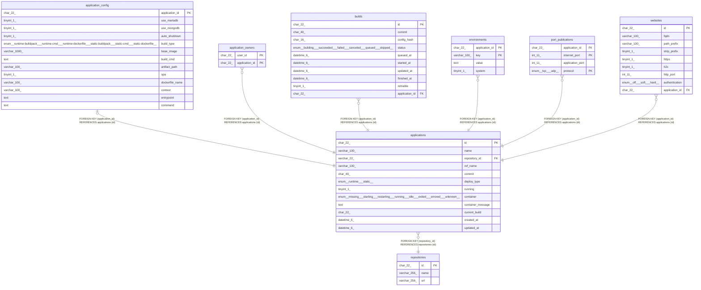

# applications

## Description

アプリケーションテーブル

<details>
<summary><strong>Table Definition</strong></summary>

```sql
CREATE TABLE `applications` (
  `id` char(22) NOT NULL COMMENT 'アプリケーションID',
  `name` varchar(100) NOT NULL COMMENT 'アプリケーション名',
  `repository_id` varchar(22) NOT NULL COMMENT 'リポジトリID',
  `ref_name` varchar(100) NOT NULL COMMENT 'Gitブランチ・タグ名',
  `commit` char(40) NOT NULL COMMENT '解決されたコミット',
  `deploy_type` enum('runtime','static') NOT NULL COMMENT 'デプロイタイプ',
  `running` tinyint(1) NOT NULL COMMENT 'アプリを起動させるか(desired state)',
  `container` enum('missing','starting','restarting','running','idle','exited','errored','unknown') NOT NULL COMMENT 'コンテナの状態(runtime only)',
  `container_message` text NOT NULL COMMENT 'コンテナの状態の詳細な情報(runtime only)',
  `current_build` char(22) NOT NULL COMMENT 'デプロイするビルド',
  `created_at` datetime(6) NOT NULL COMMENT '作成日時',
  `updated_at` datetime(6) NOT NULL COMMENT '更新日時',
  PRIMARY KEY (`id`),
  KEY `fk_applications_repository_id` (`repository_id`),
  CONSTRAINT `fk_applications_repository_id` FOREIGN KEY (`repository_id`) REFERENCES `repositories` (`id`)
) ENGINE=InnoDB DEFAULT CHARSET=utf8mb4 COLLATE=utf8mb4_general_ci COMMENT='アプリケーションテーブル'
```

</details>

## Columns

| Name | Type | Default | Nullable | Children | Parents | Comment |
| ---- | ---- | ------- | -------- | -------- | ------- | ------- |
| id | char(22) |  | false | [application_config](application_config.md) [application_owners](application_owners.md) [builds](builds.md) [environments](environments.md) [port_publications](port_publications.md) [websites](websites.md) |  | アプリケーションID |
| name | varchar(100) |  | false |  |  | アプリケーション名 |
| repository_id | varchar(22) |  | false |  | [repositories](repositories.md) | リポジトリID |
| ref_name | varchar(100) |  | false |  |  | Gitブランチ・タグ名 |
| commit | char(40) |  | false |  |  | 解決されたコミット |
| deploy_type | enum('runtime','static') |  | false |  |  | デプロイタイプ |
| running | tinyint(1) |  | false |  |  | アプリを起動させるか(desired state) |
| container | enum('missing','starting','restarting','running','idle','exited','errored','unknown') |  | false |  |  | コンテナの状態(runtime only) |
| container_message | text |  | false |  |  | コンテナの状態の詳細な情報(runtime only) |
| current_build | char(22) |  | false |  |  | デプロイするビルド |
| created_at | datetime(6) |  | false |  |  | 作成日時 |
| updated_at | datetime(6) |  | false |  |  | 更新日時 |

## Constraints

| Name | Type | Definition |
| ---- | ---- | ---------- |
| fk_applications_repository_id | FOREIGN KEY | FOREIGN KEY (repository_id) REFERENCES repositories (id) |
| PRIMARY | PRIMARY KEY | PRIMARY KEY (id) |

## Indexes

| Name | Definition |
| ---- | ---------- |
| fk_applications_repository_id | KEY fk_applications_repository_id (repository_id) USING BTREE |
| PRIMARY | PRIMARY KEY (id) USING BTREE |

## Relations



---

> Generated by [tbls](https://github.com/k1LoW/tbls)
