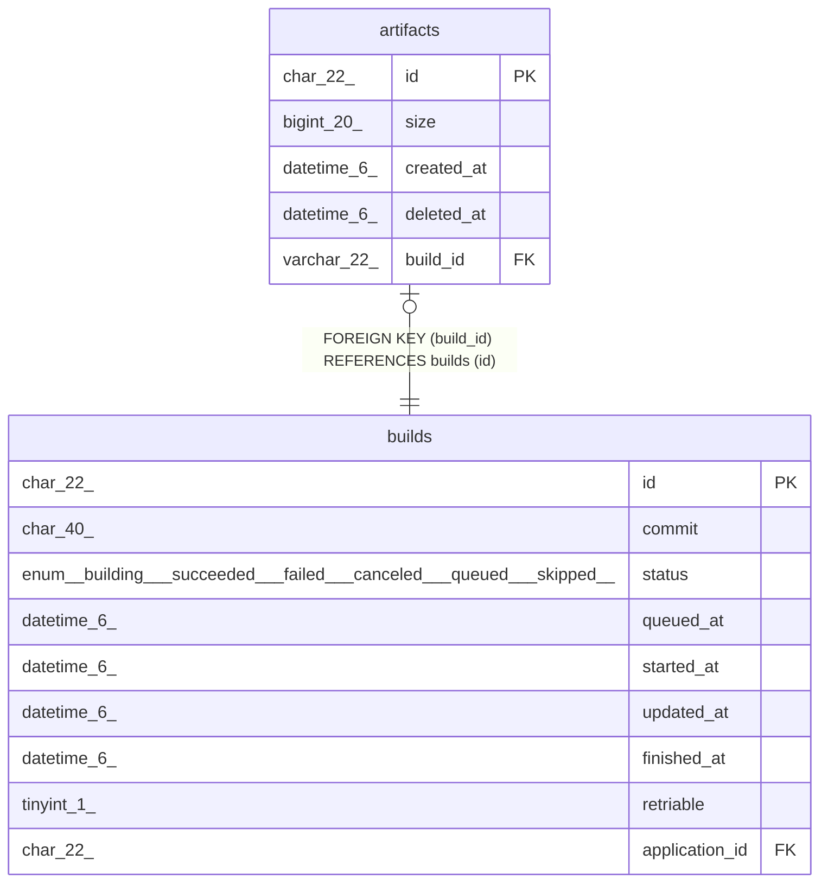

# artifacts

## Description

静的ファイル生成物テーブル

<details>
<summary><strong>Table Definition</strong></summary>

```sql
CREATE TABLE `artifacts` (
  `id` char(22) NOT NULL COMMENT '生成物ID',
  `size` bigint(20) NOT NULL COMMENT '生成物ファイルサイズ(tar)',
  `created_at` datetime(6) NOT NULL COMMENT '作成日時',
  `deleted_at` datetime(6) DEFAULT NULL COMMENT '削除日時',
  `build_id` varchar(22) NOT NULL COMMENT 'ビルドID',
  PRIMARY KEY (`id`),
  UNIQUE KEY `build_id` (`build_id`),
  CONSTRAINT `fk_artifacts_build_id` FOREIGN KEY (`build_id`) REFERENCES `builds` (`id`)
) ENGINE=InnoDB DEFAULT CHARSET=utf8mb4 COLLATE=utf8mb4_general_ci COMMENT='静的ファイル生成物テーブル'
```

</details>

## Columns

| Name | Type | Default | Nullable | Children | Parents | Comment |
| ---- | ---- | ------- | -------- | -------- | ------- | ------- |
| id | char(22) |  | false |  |  | 生成物ID |
| size | bigint(20) |  | false |  |  | 生成物ファイルサイズ(tar) |
| created_at | datetime(6) |  | false |  |  | 作成日時 |
| deleted_at | datetime(6) | NULL | true |  |  | 削除日時 |
| build_id | varchar(22) |  | false |  | [builds](builds.md) | ビルドID |

## Constraints

| Name | Type | Definition |
| ---- | ---- | ---------- |
| build_id | UNIQUE | UNIQUE KEY build_id (build_id) |
| fk_artifacts_build_id | FOREIGN KEY | FOREIGN KEY (build_id) REFERENCES builds (id) |
| PRIMARY | PRIMARY KEY | PRIMARY KEY (id) |

## Indexes

| Name | Definition |
| ---- | ---------- |
| PRIMARY | PRIMARY KEY (id) USING BTREE |
| build_id | UNIQUE KEY build_id (build_id) USING BTREE |

## Relations



---

> Generated by [tbls](https://github.com/k1LoW/tbls)
