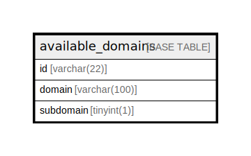

# available_domains

## Description

利用可能ドメインテーブル

<details>
<summary><strong>Table Definition</strong></summary>

```sql
CREATE TABLE `available_domains` (
  `domain` varchar(100) NOT NULL COMMENT 'ドメイン',
  `available` tinyint(1) NOT NULL COMMENT '利用可能かどうか',
  PRIMARY KEY (`domain`)
) ENGINE=InnoDB DEFAULT CHARSET=utf8mb4 COLLATE=utf8mb4_general_ci COMMENT='利用可能ドメインテーブル'
```

</details>

## Columns

| Name | Type | Default | Nullable | Children | Parents | Comment |
| ---- | ---- | ------- | -------- | -------- | ------- | ------- |
| domain | varchar(100) |  | false |  |  | ドメイン |
| available | tinyint(1) |  | false |  |  | 利用可能かどうか |

## Constraints

| Name | Type | Definition |
| ---- | ---- | ---------- |
| PRIMARY | PRIMARY KEY | PRIMARY KEY (domain) |

## Indexes

| Name | Definition |
| ---- | ---------- |
| PRIMARY | PRIMARY KEY (domain) USING BTREE |

## Relations



---

> Generated by [tbls](https://github.com/k1LoW/tbls)
