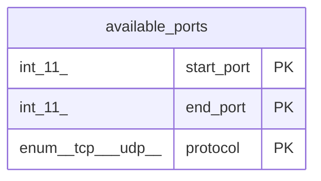

# available_ports

## Description

利用可能ポートテーブル

<details>
<summary><strong>Table Definition</strong></summary>

```sql
CREATE TABLE `available_ports` (
  `start_port` int(11) NOT NULL COMMENT 'Start of port range (inclusive)',
  `end_port` int(11) NOT NULL COMMENT 'End of port range (exclusive)',
  `protocol` enum('tcp','udp') NOT NULL COMMENT 'Protocol',
  PRIMARY KEY (`start_port`,`end_port`,`protocol`)
) ENGINE=InnoDB DEFAULT CHARSET=utf8mb4 COLLATE=utf8mb4_general_ci COMMENT='利用可能ポートテーブル'
```

</details>

## Columns

| Name | Type | Default | Nullable | Children | Parents | Comment |
| ---- | ---- | ------- | -------- | -------- | ------- | ------- |
| start_port | int(11) |  | false |  |  | Start of port range (inclusive) |
| end_port | int(11) |  | false |  |  | End of port range (exclusive) |
| protocol | enum('tcp','udp') |  | false |  |  | Protocol |

## Constraints

| Name | Type | Definition |
| ---- | ---- | ---------- |
| PRIMARY | PRIMARY KEY | PRIMARY KEY (start_port, end_port, protocol) |

## Indexes

| Name | Definition |
| ---- | ---------- |
| PRIMARY | PRIMARY KEY (start_port, end_port, protocol) USING BTREE |

## Relations



---

> Generated by [tbls](https://github.com/k1LoW/tbls)
