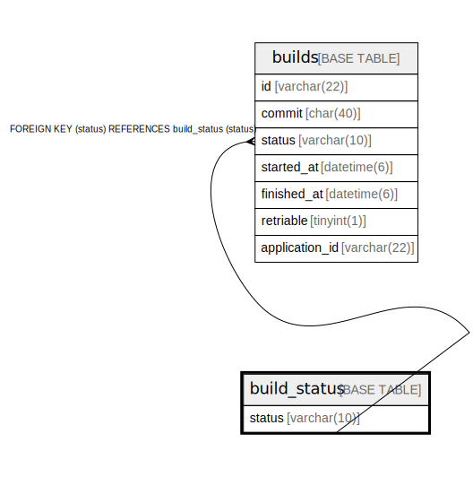

# build_status

## Description

ビルドの状態

<details>
<summary><strong>Table Definition</strong></summary>

```sql
CREATE TABLE `build_status` (
  `status` varchar(10) NOT NULL COMMENT 'ビルドの状態',
  PRIMARY KEY (`status`)
) ENGINE=InnoDB DEFAULT CHARSET=utf8mb4 COLLATE=utf8mb4_general_ci COMMENT='ビルドの状態'
```

</details>

## Columns

| Name | Type | Default | Nullable | Children | Parents | Comment |
| ---- | ---- | ------- | -------- | -------- | ------- | ------- |
| status | varchar(10) |  | false | [builds](builds.md) |  | ビルドの状態 |

## Constraints

| Name | Type | Definition |
| ---- | ---- | ---------- |
| PRIMARY | PRIMARY KEY | PRIMARY KEY (status) |

## Indexes

| Name | Definition |
| ---- | ---------- |
| PRIMARY | PRIMARY KEY (status) USING BTREE |

## Relations



---

> Generated by [tbls](https://github.com/k1LoW/tbls)
