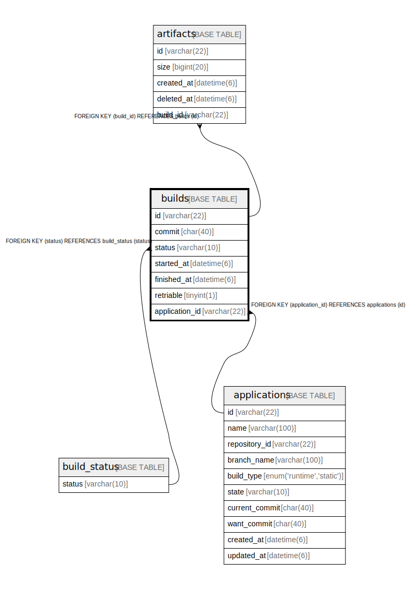

# builds

## Description

ビルドテーブル

<details>
<summary><strong>Table Definition</strong></summary>

```sql
CREATE TABLE `builds` (
  `id` varchar(22) NOT NULL COMMENT 'ビルドID',
  `status` varchar(10) NOT NULL COMMENT 'ビルドの状態',
  `started_at` datetime(6) NOT NULL COMMENT 'ビルド開始日時',
  `finished_at` datetime(6) DEFAULT NULL COMMENT 'ビルド終了日時',
  `application_id` varchar(22) NOT NULL COMMENT 'アプリケーションID',
  PRIMARY KEY (`id`),
  KEY `fk_builds_status` (`status`),
  KEY `fk_builds_application_id` (`application_id`),
  CONSTRAINT `fk_builds_application_id` FOREIGN KEY (`application_id`) REFERENCES `applications` (`id`),
  CONSTRAINT `fk_builds_status` FOREIGN KEY (`status`) REFERENCES `build_status` (`status`)
) ENGINE=InnoDB DEFAULT CHARSET=utf8mb4 COLLATE=utf8mb4_general_ci COMMENT='ビルドテーブル'
```

</details>

## Columns

| Name | Type | Default | Nullable | Children | Parents | Comment |
| ---- | ---- | ------- | -------- | -------- | ------- | ------- |
| id | varchar(22) |  | false | [artifacts](artifacts.md) |  | ビルドID |
| status | varchar(10) |  | false |  | [build_status](build_status.md) | ビルドの状態 |
| started_at | datetime(6) |  | false |  |  | ビルド開始日時 |
| finished_at | datetime(6) | NULL | true |  |  | ビルド終了日時 |
| application_id | varchar(22) |  | false |  | [applications](applications.md) | アプリケーションID |

## Constraints

| Name | Type | Definition |
| ---- | ---- | ---------- |
| fk_builds_application_id | FOREIGN KEY | FOREIGN KEY (application_id) REFERENCES applications (id) |
| fk_builds_status | FOREIGN KEY | FOREIGN KEY (status) REFERENCES build_status (status) |
| PRIMARY | PRIMARY KEY | PRIMARY KEY (id) |

## Indexes

| Name | Definition |
| ---- | ---------- |
| fk_builds_application_id | KEY fk_builds_application_id (application_id) USING BTREE |
| fk_builds_status | KEY fk_builds_status (status) USING BTREE |
| PRIMARY | PRIMARY KEY (id) USING BTREE |

## Relations



---

> Generated by [tbls](https://github.com/k1LoW/tbls)
