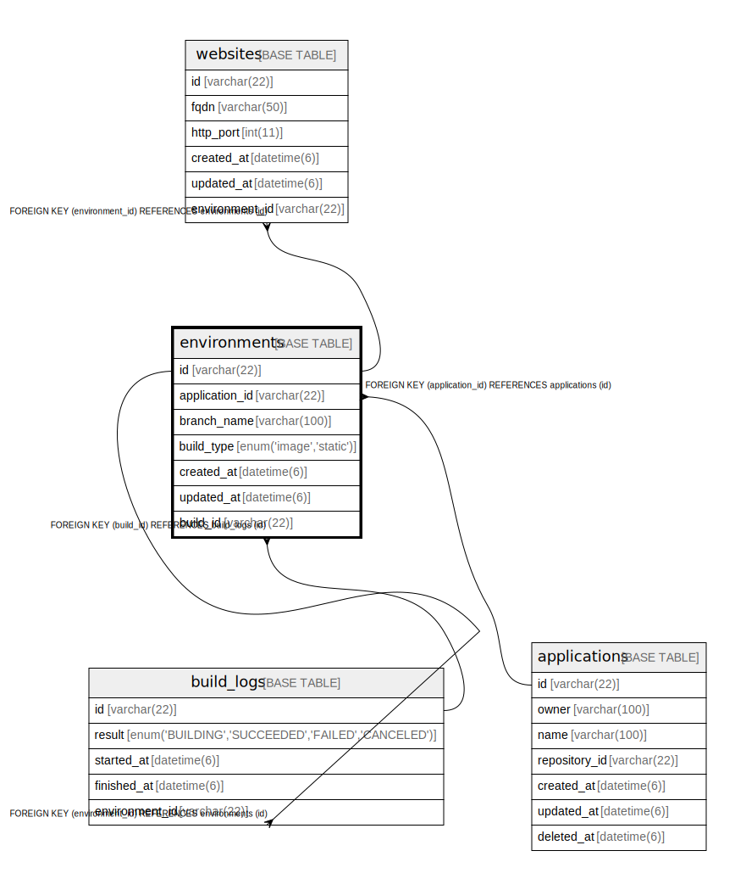

# environments

## Description

アプリ環境テーブル

<details>
<summary><strong>Table Definition</strong></summary>

```sql
CREATE TABLE `environments` (
  `id` varchar(22) NOT NULL COMMENT '環境ID',
  `application_id` varchar(22) NOT NULL COMMENT 'アプリケーションID',
  `branch_name` varchar(100) NOT NULL COMMENT 'Gitブランチ・タグ名',
  `build_type` enum('image','static') NOT NULL COMMENT 'ビルドタイプ',
  `created_at` datetime(6) NOT NULL COMMENT '作成日時',
  `updated_at` datetime(6) NOT NULL COMMENT '更新日時',
  `build_id` varchar(22) DEFAULT NULL COMMENT '稼働中のビルドID',
  PRIMARY KEY (`id`),
  UNIQUE KEY `application_id` (`application_id`,`branch_name`),
  KEY `fk_environments_build_id` (`build_id`),
  CONSTRAINT `fk_environments_application_id` FOREIGN KEY (`application_id`) REFERENCES `applications` (`id`),
  CONSTRAINT `fk_environments_build_id` FOREIGN KEY (`build_id`) REFERENCES `build_logs` (`id`)
) ENGINE=InnoDB DEFAULT CHARSET=utf8mb4 COMMENT='アプリ環境テーブル'
```

</details>

## Columns

| Name | Type | Default | Nullable | Children | Parents | Comment |
| ---- | ---- | ------- | -------- | -------- | ------- | ------- |
| id | varchar(22) |  | false | [build_logs](build_logs.md) [websites](websites.md) |  | 環境ID |
| application_id | varchar(22) |  | false |  | [applications](applications.md) | アプリケーションID |
| branch_name | varchar(100) |  | false |  |  | Gitブランチ・タグ名 |
| build_type | enum('image','static') |  | false |  |  | ビルドタイプ |
| created_at | datetime(6) |  | false |  |  | 作成日時 |
| updated_at | datetime(6) |  | false |  |  | 更新日時 |
| build_id | varchar(22) |  | true |  | [build_logs](build_logs.md) | 稼働中のビルドID |

## Constraints

| Name | Type | Definition |
| ---- | ---- | ---------- |
| application_id | UNIQUE | UNIQUE KEY application_id (application_id, branch_name) |
| fk_environments_application_id | FOREIGN KEY | FOREIGN KEY (application_id) REFERENCES applications (id) |
| fk_environments_build_id | FOREIGN KEY | FOREIGN KEY (build_id) REFERENCES build_logs (id) |
| PRIMARY | PRIMARY KEY | PRIMARY KEY (id) |

## Indexes

| Name | Definition |
| ---- | ---------- |
| fk_environments_build_id | KEY fk_environments_build_id (build_id) USING BTREE |
| PRIMARY | PRIMARY KEY (id) USING BTREE |
| application_id | UNIQUE KEY application_id (application_id, branch_name) USING BTREE |

## Relations



---

> Generated by [tbls](https://github.com/k1LoW/tbls)
