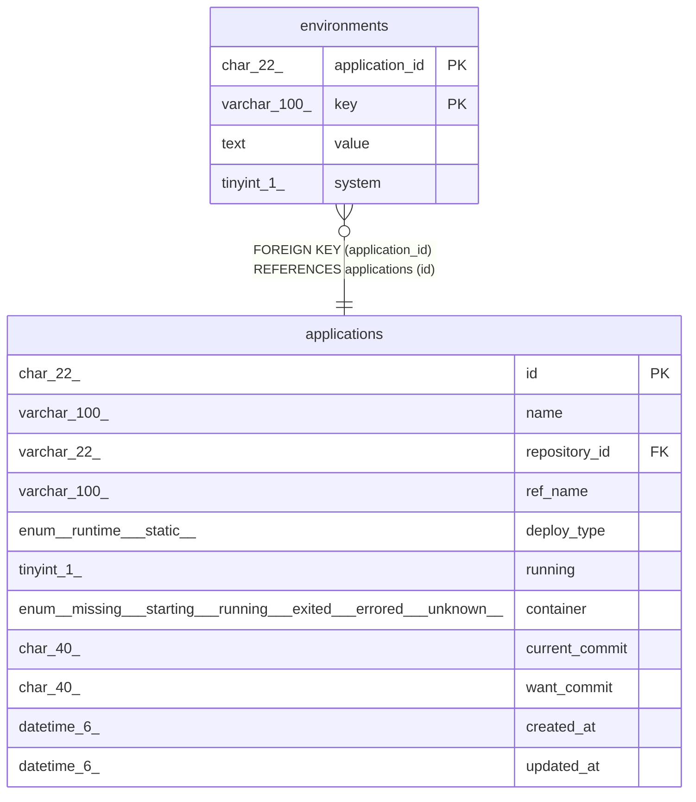

# environments

## Description

環境変数テーブル

<details>
<summary><strong>Table Definition</strong></summary>

```sql
CREATE TABLE `environments` (
  `application_id` char(22) NOT NULL COMMENT 'アプリケーションID',
  `key` varchar(100) NOT NULL COMMENT '環境変数のキー',
  `value` text NOT NULL COMMENT '環境変数の値',
  `system` tinyint(1) NOT NULL COMMENT 'システムによって設定された環境変数かどうか',
  PRIMARY KEY (`application_id`,`key`),
  CONSTRAINT `fk_environments_application_id` FOREIGN KEY (`application_id`) REFERENCES `applications` (`id`)
) ENGINE=InnoDB DEFAULT CHARSET=utf8mb4 COLLATE=utf8mb4_general_ci COMMENT='環境変数テーブル'
```

</details>

## Columns

| Name | Type | Default | Nullable | Children | Parents | Comment |
| ---- | ---- | ------- | -------- | -------- | ------- | ------- |
| application_id | char(22) |  | false |  | [applications](applications.md) | アプリケーションID |
| key | varchar(100) |  | false |  |  | 環境変数のキー |
| value | text |  | false |  |  | 環境変数の値 |
| system | tinyint(1) |  | false |  |  | システムによって設定された環境変数かどうか |

## Constraints

| Name | Type | Definition |
| ---- | ---- | ---------- |
| fk_environments_application_id | FOREIGN KEY | FOREIGN KEY (application_id) REFERENCES applications (id) |
| PRIMARY | PRIMARY KEY | PRIMARY KEY (application_id, key) |

## Indexes

| Name | Definition |
| ---- | ---------- |
| PRIMARY | PRIMARY KEY (application_id, key) USING BTREE |

## Relations



---

> Generated by [tbls](https://github.com/k1LoW/tbls)
