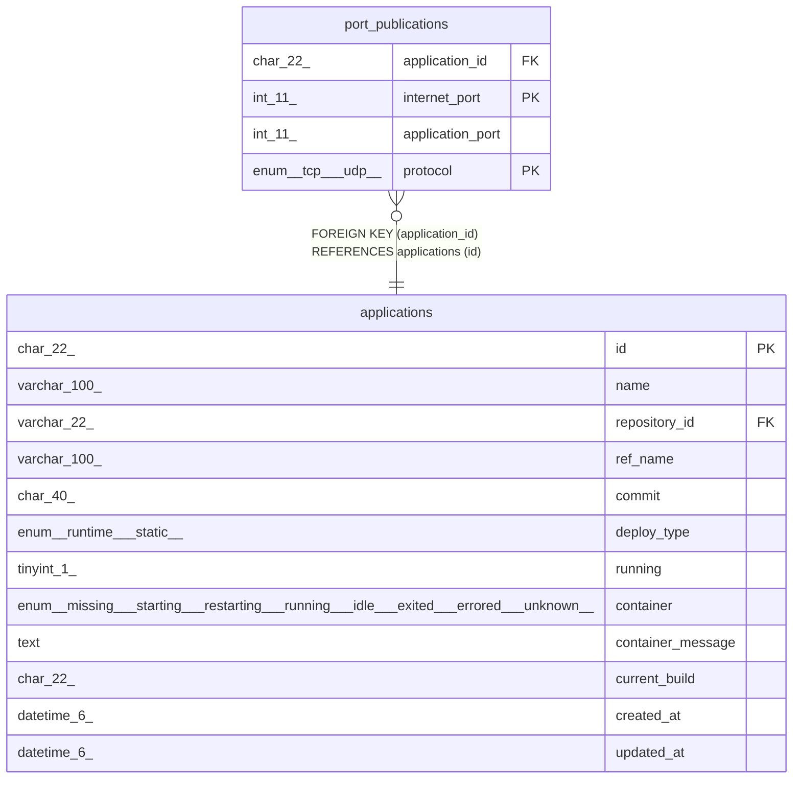

# port_publications

## Description

公開ポートテーブル

<details>
<summary><strong>Table Definition</strong></summary>

```sql
CREATE TABLE `port_publications` (
  `application_id` char(22) NOT NULL COMMENT 'アプリケーションID',
  `internet_port` int(11) NOT NULL COMMENT '公開側ポート',
  `application_port` int(11) NOT NULL COMMENT 'アプリケーション側ポート',
  `protocol` enum('tcp','udp') NOT NULL COMMENT 'プロトコル',
  PRIMARY KEY (`internet_port`,`protocol`),
  KEY `fk_port_publications_application_id` (`application_id`),
  CONSTRAINT `fk_port_publications_application_id` FOREIGN KEY (`application_id`) REFERENCES `applications` (`id`)
) ENGINE=InnoDB DEFAULT CHARSET=utf8mb4 COLLATE=utf8mb4_general_ci COMMENT='公開ポートテーブル'
```

</details>

## Columns

| Name | Type | Default | Nullable | Children | Parents | Comment |
| ---- | ---- | ------- | -------- | -------- | ------- | ------- |
| application_id | char(22) |  | false |  | [applications](applications.md) | アプリケーションID |
| internet_port | int(11) |  | false |  |  | 公開側ポート |
| application_port | int(11) |  | false |  |  | アプリケーション側ポート |
| protocol | enum('tcp','udp') |  | false |  |  | プロトコル |

## Constraints

| Name | Type | Definition |
| ---- | ---- | ---------- |
| fk_port_publications_application_id | FOREIGN KEY | FOREIGN KEY (application_id) REFERENCES applications (id) |
| PRIMARY | PRIMARY KEY | PRIMARY KEY (internet_port, protocol) |

## Indexes

| Name | Definition |
| ---- | ---------- |
| fk_port_publications_application_id | KEY fk_port_publications_application_id (application_id) USING BTREE |
| PRIMARY | PRIMARY KEY (internet_port, protocol) USING BTREE |

## Relations



---

> Generated by [tbls](https://github.com/k1LoW/tbls)
