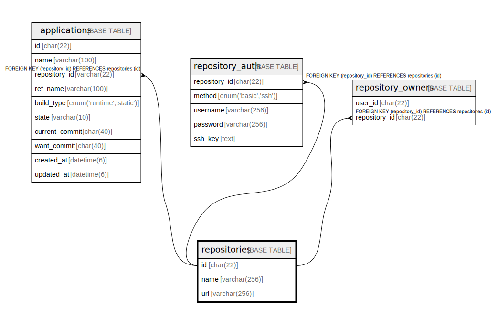

# repositories

## Description

Gitリポジトリテーブル

<details>
<summary><strong>Table Definition</strong></summary>

```sql
CREATE TABLE `repositories` (
  `id` varchar(22) NOT NULL COMMENT 'リポジトリID',
  `remote` text NOT NULL COMMENT 'Git Remote URL',
  `refs` text NOT NULL COMMENT '使用するGit Ref',
  PRIMARY KEY (`id`)
) ENGINE=InnoDB DEFAULT CHARSET=utf8mb4 COMMENT='Gitリポジトリテーブル'
```

</details>

## Columns

| Name | Type | Default | Nullable | Children | Parents | Comment |
| ---- | ---- | ------- | -------- | -------- | ------- | ------- |
| id | varchar(22) |  | false | [applications](applications.md) |  | リポジトリID |
| remote | text |  | false |  |  | Git Remote URL |
| refs | text |  | false |  |  | 使用するGit Ref |

## Constraints

| Name | Type | Definition |
| ---- | ---- | ---------- |
| PRIMARY | PRIMARY KEY | PRIMARY KEY (id) |

## Indexes

| Name | Definition |
| ---- | ---------- |
| PRIMARY | PRIMARY KEY (id) USING BTREE |

## Relations



---

> Generated by [tbls](https://github.com/k1LoW/tbls)
