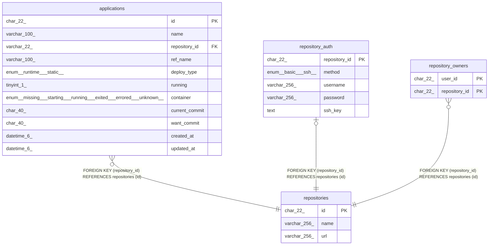

# repositories

## Description

Gitリポジトリテーブル

<details>
<summary><strong>Table Definition</strong></summary>

```sql
CREATE TABLE `repositories` (
  `id` char(22) NOT NULL COMMENT 'リポジトリID',
  `name` varchar(256) NOT NULL COMMENT 'リポジトリ名',
  `url` varchar(256) NOT NULL COMMENT 'Git Remote URL',
  PRIMARY KEY (`id`),
  UNIQUE KEY `url` (`url`)
) ENGINE=InnoDB DEFAULT CHARSET=utf8mb4 COLLATE=utf8mb4_general_ci COMMENT='Gitリポジトリテーブル'
```

</details>

## Columns

| Name | Type | Default | Nullable | Children | Parents | Comment |
| ---- | ---- | ------- | -------- | -------- | ------- | ------- |
| id | char(22) |  | false | [applications](applications.md) [repository_auth](repository_auth.md) [repository_owners](repository_owners.md) |  | リポジトリID |
| name | varchar(256) |  | false |  |  | リポジトリ名 |
| url | varchar(256) |  | false |  |  | Git Remote URL |

## Constraints

| Name | Type | Definition |
| ---- | ---- | ---------- |
| PRIMARY | PRIMARY KEY | PRIMARY KEY (id) |
| url | UNIQUE | UNIQUE KEY url (url) |

## Indexes

| Name | Definition |
| ---- | ---------- |
| PRIMARY | PRIMARY KEY (id) USING BTREE |
| url | UNIQUE KEY url (url) USING BTREE |

## Relations



---

> Generated by [tbls](https://github.com/k1LoW/tbls)
