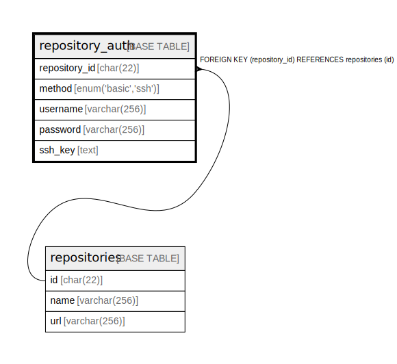

# repository_auth

## Description

Gitリポジトリ認証情報テーブル

<details>
<summary><strong>Table Definition</strong></summary>

```sql
CREATE TABLE `repository_auth` (
  `repository_id` char(22) NOT NULL COMMENT 'リポジトリID',
  `method` enum('basic','ssh') NOT NULL COMMENT '認証方法',
  `username` varchar(256) NOT NULL COMMENT '(basic)ユーザー名',
  `password` varchar(256) NOT NULL COMMENT '(basic)パスワード',
  `ssh_key` text NOT NULL COMMENT '(ssh)PEM encoded private key',
  PRIMARY KEY (`repository_id`),
  CONSTRAINT `fk_repository_auth_repository_id` FOREIGN KEY (`repository_id`) REFERENCES `repositories` (`id`)
) ENGINE=InnoDB DEFAULT CHARSET=utf8mb4 COLLATE=utf8mb4_general_ci COMMENT='Gitリポジトリ認証情報テーブル'
```

</details>

## Columns

| Name | Type | Default | Nullable | Children | Parents | Comment |
| ---- | ---- | ------- | -------- | -------- | ------- | ------- |
| repository_id | char(22) |  | false |  | [repositories](repositories.md) | リポジトリID |
| method | enum('basic','ssh') |  | false |  |  | 認証方法 |
| username | varchar(256) |  | false |  |  | (basic)ユーザー名 |
| password | varchar(256) |  | false |  |  | (basic)パスワード |
| ssh_key | text |  | false |  |  | (ssh)PEM encoded private key |

## Constraints

| Name | Type | Definition |
| ---- | ---- | ---------- |
| fk_repository_auth_repository_id | FOREIGN KEY | FOREIGN KEY (repository_id) REFERENCES repositories (id) |
| PRIMARY | PRIMARY KEY | PRIMARY KEY (repository_id) |

## Indexes

| Name | Definition |
| ---- | ---------- |
| PRIMARY | PRIMARY KEY (repository_id) USING BTREE |

## Relations



---

> Generated by [tbls](https://github.com/k1LoW/tbls)
