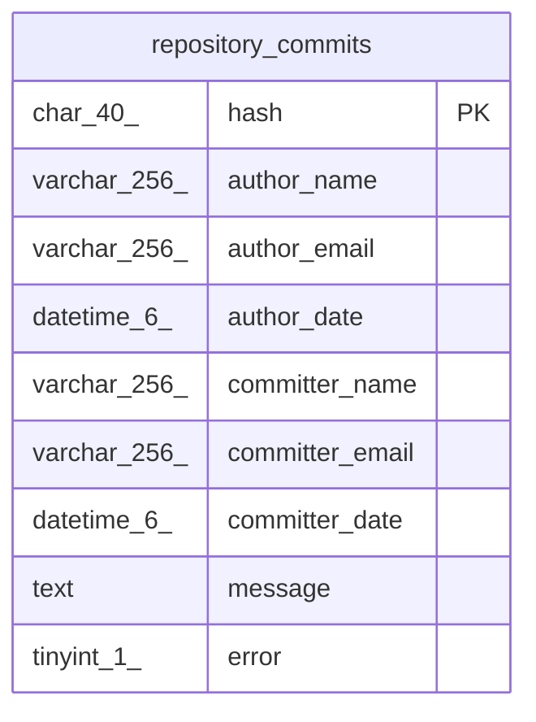

# repository_commits

## Description

コミットメタ情報テーブル

<details>
<summary><strong>Table Definition</strong></summary>

```sql
CREATE TABLE `repository_commits` (
  `hash` char(40) NOT NULL COMMENT 'Commit SHA-1 Hash',
  `author_name` varchar(256) NOT NULL COMMENT 'Author Name',
  `author_email` varchar(256) NOT NULL COMMENT 'Author Email',
  `author_date` datetime(6) NOT NULL COMMENT 'Author Date',
  `committer_name` varchar(256) NOT NULL COMMENT 'Committer Name',
  `committer_email` varchar(256) NOT NULL COMMENT 'Committer Email',
  `committer_date` datetime(6) NOT NULL COMMENT 'Commit Date',
  `message` text NOT NULL COMMENT 'Commit Message',
  `error` tinyint(1) NOT NULL COMMENT 'メタ情報取得に失敗したか',
  PRIMARY KEY (`hash`)
) ENGINE=InnoDB DEFAULT CHARSET=utf8mb4 COLLATE=utf8mb4_general_ci COMMENT='コミットメタ情報テーブル'
```

</details>

## Columns

| Name | Type | Default | Nullable | Children | Parents | Comment |
| ---- | ---- | ------- | -------- | -------- | ------- | ------- |
| hash | char(40) |  | false |  |  | Commit SHA-1 Hash |
| author_name | varchar(256) |  | false |  |  | Author Name |
| author_email | varchar(256) |  | false |  |  | Author Email |
| author_date | datetime(6) |  | false |  |  | Author Date |
| committer_name | varchar(256) |  | false |  |  | Committer Name |
| committer_email | varchar(256) |  | false |  |  | Committer Email |
| committer_date | datetime(6) |  | false |  |  | Commit Date |
| message | text |  | false |  |  | Commit Message |
| error | tinyint(1) |  | false |  |  | メタ情報取得に失敗したか |

## Constraints

| Name | Type | Definition |
| ---- | ---- | ---------- |
| PRIMARY | PRIMARY KEY | PRIMARY KEY (hash) |

## Indexes

| Name | Definition |
| ---- | ---------- |
| PRIMARY | PRIMARY KEY (hash) USING BTREE |

## Relations



---

> Generated by [tbls](https://github.com/k1LoW/tbls)
