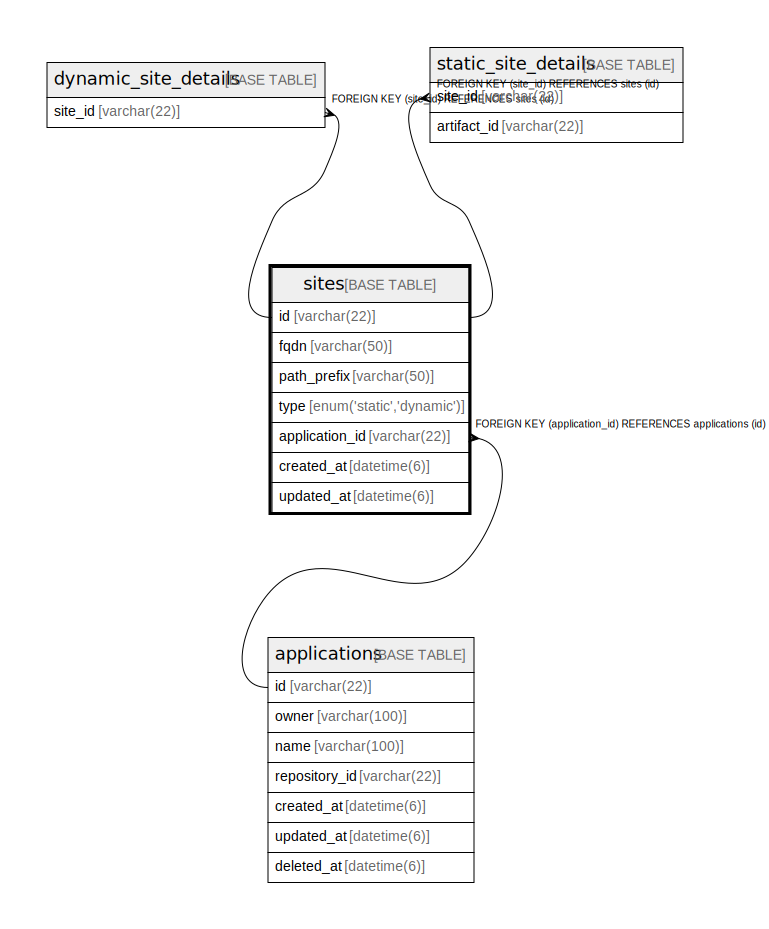

# sites

## Description

サイトテーブル

<details>
<summary><strong>Table Definition</strong></summary>

```sql
CREATE TABLE `sites` (
  `id` varchar(22) NOT NULL COMMENT 'サイトID',
  `fqdn` varchar(50) NOT NULL COMMENT 'サイトURLのFQDN',
  `path_prefix` varchar(50) NOT NULL COMMENT 'サイトURLのパスプレフィックス',
  `type` enum('static','dynamic') NOT NULL COMMENT 'サイト種類',
  `application_id` varchar(22) NOT NULL COMMENT 'アプリケーションID',
  `created_at` datetime(6) NOT NULL COMMENT '作成日時',
  `updated_at` datetime(6) NOT NULL COMMENT '更新日時',
  PRIMARY KEY (`id`),
  UNIQUE KEY `fqdn` (`fqdn`,`path_prefix`),
  KEY `fk_sites_application_id` (`application_id`),
  CONSTRAINT `fk_sites_application_id` FOREIGN KEY (`application_id`) REFERENCES `applications` (`id`)
) ENGINE=InnoDB DEFAULT CHARSET=utf8mb4 COMMENT='サイトテーブル'
```

</details>

## Columns

| Name | Type | Default | Nullable | Children | Parents | Comment |
| ---- | ---- | ------- | -------- | -------- | ------- | ------- |
| id | varchar(22) |  | false | [dynamic_site_details](dynamic_site_details.md) [static_site_details](static_site_details.md) |  | サイトID |
| fqdn | varchar(50) |  | false |  |  | サイトURLのFQDN |
| path_prefix | varchar(50) |  | false |  |  | サイトURLのパスプレフィックス |
| type | enum('static','dynamic') |  | false |  |  | サイト種類 |
| application_id | varchar(22) |  | false |  | [applications](applications.md) | アプリケーションID |
| created_at | datetime(6) |  | false |  |  | 作成日時 |
| updated_at | datetime(6) |  | false |  |  | 更新日時 |

## Constraints

| Name | Type | Definition |
| ---- | ---- | ---------- |
| fk_sites_application_id | FOREIGN KEY | FOREIGN KEY (application_id) REFERENCES applications (id) |
| fqdn | UNIQUE | UNIQUE KEY fqdn (fqdn, path_prefix) |
| PRIMARY | PRIMARY KEY | PRIMARY KEY (id) |

## Indexes

| Name | Definition |
| ---- | ---------- |
| fk_sites_application_id | KEY fk_sites_application_id (application_id) USING BTREE |
| PRIMARY | PRIMARY KEY (id) USING BTREE |
| fqdn | UNIQUE KEY fqdn (fqdn, path_prefix) USING BTREE |

## Relations



---

> Generated by [tbls](https://github.com/k1LoW/tbls)
