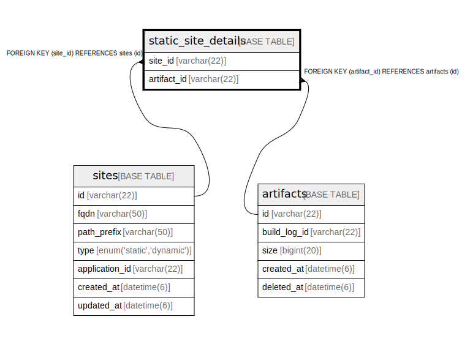

# static_site_details

## Description

静的サイト詳細テーブル

<details>
<summary><strong>Table Definition</strong></summary>

```sql
CREATE TABLE `static_site_details` (
  `site_id` varchar(22) NOT NULL COMMENT 'サイトID',
  `artifact_id` varchar(22) DEFAULT NULL COMMENT '配信する静的ファイル生成物のID',
  PRIMARY KEY (`site_id`),
  KEY `fk_static_site_details_artifact_id` (`artifact_id`),
  CONSTRAINT `fk_static_site_details_artifact_id` FOREIGN KEY (`artifact_id`) REFERENCES `artifacts` (`id`),
  CONSTRAINT `fk_static_site_details_site_id` FOREIGN KEY (`site_id`) REFERENCES `sites` (`id`) ON DELETE CASCADE ON UPDATE CASCADE
) ENGINE=InnoDB DEFAULT CHARSET=utf8mb4 COMMENT='静的サイト詳細テーブル'
```

</details>

## Columns

| Name | Type | Default | Nullable | Children | Parents | Comment |
| ---- | ---- | ------- | -------- | -------- | ------- | ------- |
| site_id | varchar(22) |  | false |  | [sites](sites.md) | サイトID |
| artifact_id | varchar(22) |  | true |  | [artifacts](artifacts.md) | 配信する静的ファイル生成物のID |

## Constraints

| Name | Type | Definition |
| ---- | ---- | ---------- |
| fk_static_site_details_artifact_id | FOREIGN KEY | FOREIGN KEY (artifact_id) REFERENCES artifacts (id) |
| fk_static_site_details_site_id | FOREIGN KEY | FOREIGN KEY (site_id) REFERENCES sites (id) |
| PRIMARY | PRIMARY KEY | PRIMARY KEY (site_id) |

## Indexes

| Name | Definition |
| ---- | ---------- |
| fk_static_site_details_artifact_id | KEY fk_static_site_details_artifact_id (artifact_id) USING BTREE |
| PRIMARY | PRIMARY KEY (site_id) USING BTREE |

## Relations



---

> Generated by [tbls](https://github.com/k1LoW/tbls)
