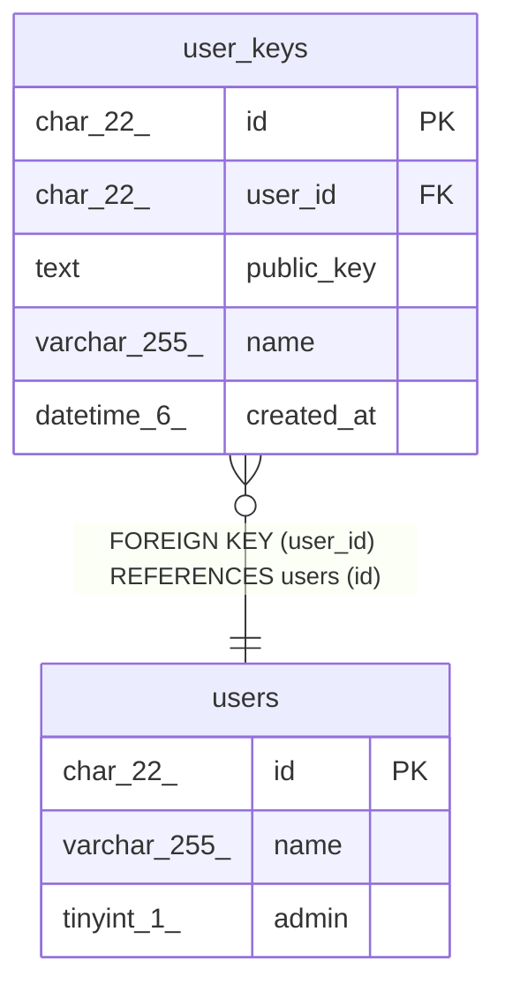

# user_keys

## Description

ユーザーSSHキーテーブル

<details>
<summary><strong>Table Definition</strong></summary>

```sql
CREATE TABLE `user_keys` (
  `id` char(22) NOT NULL COMMENT 'ID',
  `user_id` char(22) NOT NULL COMMENT 'ユーザーID',
  `public_key` text NOT NULL COMMENT 'SSH Public Key',
  `name` varchar(255) NOT NULL DEFAULT '' COMMENT 'キー名',
  `created_at` datetime(6) NOT NULL DEFAULT '1970-01-01 00:00:00.000000' COMMENT '作成日時',
  PRIMARY KEY (`id`),
  KEY `fk_user_keys_user_id` (`user_id`),
  CONSTRAINT `fk_user_keys_user_id` FOREIGN KEY (`user_id`) REFERENCES `users` (`id`)
) ENGINE=InnoDB DEFAULT CHARSET=utf8mb4 COLLATE=utf8mb4_general_ci COMMENT='ユーザーSSHキーテーブル'
```

</details>

## Columns

| Name | Type | Default | Nullable | Children | Parents | Comment |
| ---- | ---- | ------- | -------- | -------- | ------- | ------- |
| id | char(22) |  | false |  |  | ID |
| user_id | char(22) |  | false |  | [users](users.md) | ユーザーID |
| public_key | text |  | false |  |  | SSH Public Key |
| name | varchar(255) | '' | false |  |  | キー名 |
| created_at | datetime(6) | '1970-01-01 00:00:00.000000' | false |  |  | 作成日時 |

## Constraints

| Name | Type | Definition |
| ---- | ---- | ---------- |
| fk_user_keys_user_id | FOREIGN KEY | FOREIGN KEY (user_id) REFERENCES users (id) |
| PRIMARY | PRIMARY KEY | PRIMARY KEY (id) |

## Indexes

| Name | Definition |
| ---- | ---------- |
| fk_user_keys_user_id | KEY fk_user_keys_user_id (user_id) USING BTREE |
| PRIMARY | PRIMARY KEY (id) USING BTREE |

## Relations



---

> Generated by [tbls](https://github.com/k1LoW/tbls)
