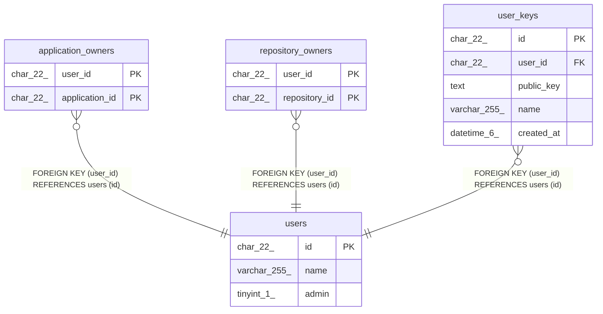

# users

## Description

ユーザーテーブル

<details>
<summary><strong>Table Definition</strong></summary>

```sql
CREATE TABLE `users` (
  `id` char(22) NOT NULL COMMENT 'ユーザーID',
  `name` varchar(255) NOT NULL COMMENT 'ユーザー名',
  `admin` tinyint(1) NOT NULL COMMENT 'Admin Flag',
  PRIMARY KEY (`id`)
) ENGINE=InnoDB DEFAULT CHARSET=utf8mb4 COLLATE=utf8mb4_general_ci COMMENT='ユーザーテーブル'
```

</details>

## Columns

| Name | Type | Default | Nullable | Children | Parents | Comment |
| ---- | ---- | ------- | -------- | -------- | ------- | ------- |
| id | char(22) |  | false | [application_owners](application_owners.md) [repository_owners](repository_owners.md) [user_keys](user_keys.md) |  | ユーザーID |
| name | varchar(255) |  | false |  |  | ユーザー名 |
| admin | tinyint(1) |  | false |  |  | Admin Flag |

## Constraints

| Name | Type | Definition |
| ---- | ---- | ---------- |
| PRIMARY | PRIMARY KEY | PRIMARY KEY (id) |

## Indexes

| Name | Definition |
| ---- | ---------- |
| PRIMARY | PRIMARY KEY (id) USING BTREE |

## Relations



---

> Generated by [tbls](https://github.com/k1LoW/tbls)
