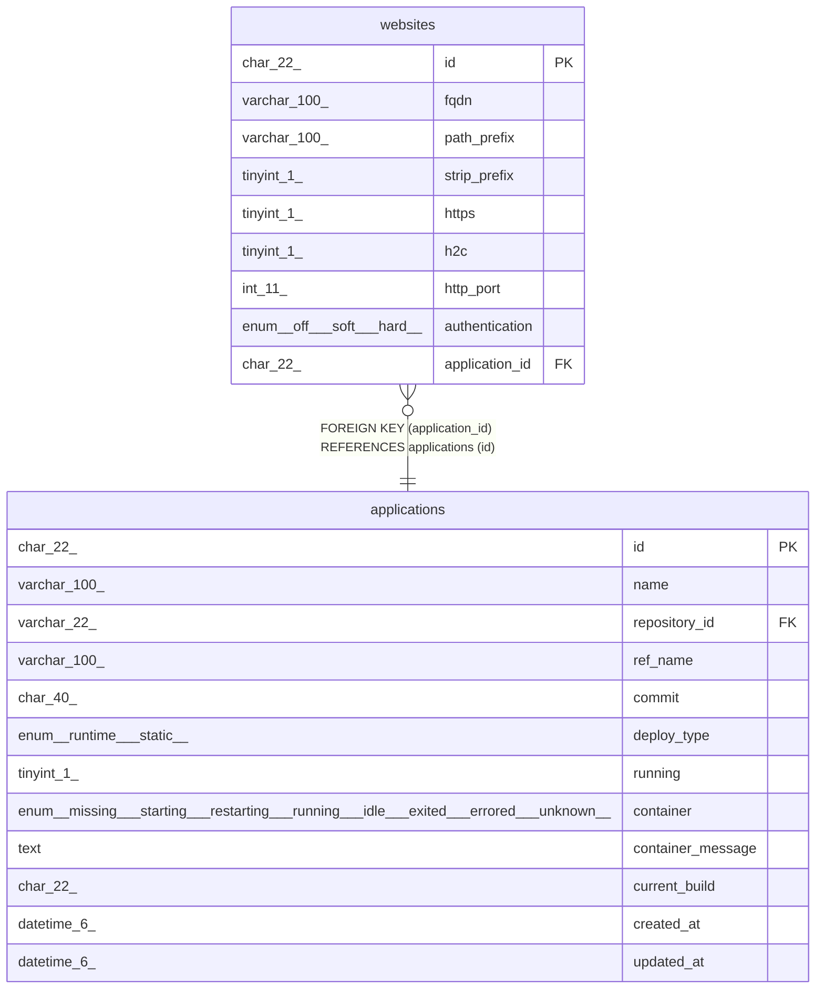

# websites

## Description

Webサイトテーブル

<details>
<summary><strong>Table Definition</strong></summary>

```sql
CREATE TABLE `websites` (
  `id` char(22) NOT NULL COMMENT 'サイトID',
  `fqdn` varchar(100) NOT NULL COMMENT 'サイトURLのFQDN',
  `path_prefix` varchar(100) NOT NULL COMMENT 'サイトPathのPrefix',
  `strip_prefix` tinyint(1) NOT NULL COMMENT 'PathのPrefixを落とすかどうか',
  `https` tinyint(1) NOT NULL COMMENT 'httpsの接続かどうか',
  `h2c` tinyint(1) NOT NULL COMMENT '(advanced)プロキシとアプリの通信にh2c protocolを使うかどうか',
  `http_port` int(11) NOT NULL DEFAULT 80 COMMENT '(runtime only)コンテナhttpポート番号',
  `authentication` enum('off','soft','hard') NOT NULL COMMENT 'traP部員認証タイプ',
  `application_id` char(22) NOT NULL COMMENT 'アプリケーションID',
  PRIMARY KEY (`id`),
  KEY `fk_websites_application_id` (`application_id`),
  CONSTRAINT `fk_websites_application_id` FOREIGN KEY (`application_id`) REFERENCES `applications` (`id`)
) ENGINE=InnoDB DEFAULT CHARSET=utf8mb4 COLLATE=utf8mb4_general_ci COMMENT='Webサイトテーブル'
```

</details>

## Columns

| Name | Type | Default | Nullable | Children | Parents | Comment |
| ---- | ---- | ------- | -------- | -------- | ------- | ------- |
| id | char(22) |  | false |  |  | サイトID |
| fqdn | varchar(100) |  | false |  |  | サイトURLのFQDN |
| path_prefix | varchar(100) |  | false |  |  | サイトPathのPrefix |
| strip_prefix | tinyint(1) |  | false |  |  | PathのPrefixを落とすかどうか |
| https | tinyint(1) |  | false |  |  | httpsの接続かどうか |
| h2c | tinyint(1) |  | false |  |  | (advanced)プロキシとアプリの通信にh2c protocolを使うかどうか |
| http_port | int(11) | 80 | false |  |  | (runtime only)コンテナhttpポート番号 |
| authentication | enum('off','soft','hard') |  | false |  |  | traP部員認証タイプ |
| application_id | char(22) |  | false |  | [applications](applications.md) | アプリケーションID |

## Constraints

| Name | Type | Definition |
| ---- | ---- | ---------- |
| fk_websites_application_id | FOREIGN KEY | FOREIGN KEY (application_id) REFERENCES applications (id) |
| PRIMARY | PRIMARY KEY | PRIMARY KEY (id) |

## Indexes

| Name | Definition |
| ---- | ---------- |
| fk_websites_application_id | KEY fk_websites_application_id (application_id) USING BTREE |
| PRIMARY | PRIMARY KEY (id) USING BTREE |

## Relations



---

> Generated by [tbls](https://github.com/k1LoW/tbls)
